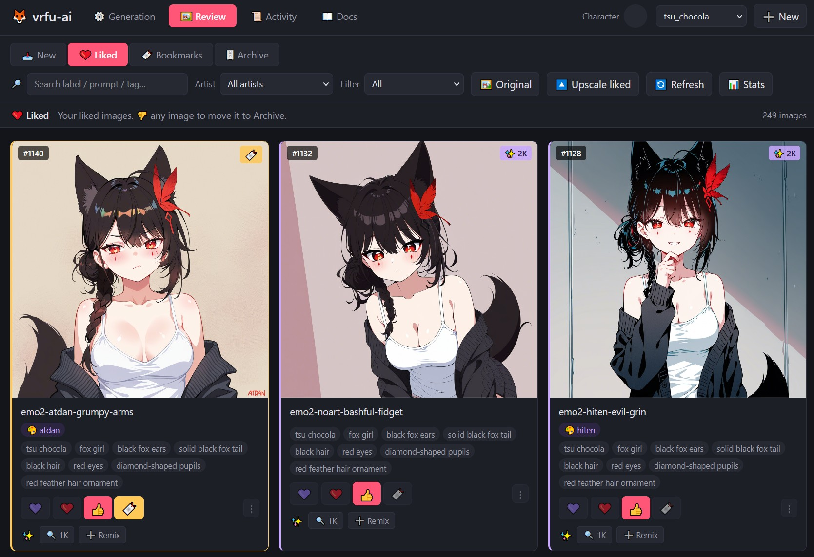

# vrfu-ai

Local SDXL pipeline for generating anime art of custom characters,
**designed to be operated through an LLM agent** — Claude Code, Cursor,
Aider, or anything else with filesystem access. The repo's docs and
`CLAUDE.md` are written so an agent can guide setup, training, and
prompt-building without you needing to memorize commands. Everything
runs on your own machine: no cloud, no API keys, no rate limits.



## How it's meant to be used

1. Clone the repo and run `setup.bat` once.
2. Open the repo in your agent of choice (Cursor: `File → Open Folder`,
   Claude Code: `cd vrfu-ai && claude`).
3. Tell the agent what you want:
   - *"Set up a new character — I have reference images at ..."*
   - *"Queue 50 affection-themed prompts for tsu_chocola, intimate framing"*
   - *"Export the mari character so I can send it to a friend"*
   - *"Why is my RTX 5070 Ti generation slow?"*

The agent reads `CLAUDE.md` (project orientation), the `docs/` tree
(detailed how-tos), and your character configs to know what's safe,
what's idiomatic, and what your preferences look like. You can also
operate everything manually through the web UI at
`http://localhost:8765` — the agent and the UI both talk to the same
files.

## The preference-learning loop

The web UI's voting + commenting on generated images isn't just for
sorting — those signals are how an agent learns what you actually like:

- 💜 **Super Like** / ❤️ **Love** / 👍 **Like** → positive signal
- 🎨 **Style** / 📍 **Location** / 🤸 **Pose** / 👗 **Clothes** → *what specifically* you liked, so the agent can repeat just that aspect
- 🔖 **Bookmark** → save without committing to liking it
- 👎 **Skip** / ⚠️ **Bad anatomy** → negative signal; bad-anatomy auto-archives
- ✏️ Comments → free-form feedback the agent can read

When you ask an agent to write more prompts, it can read your liked
images' prompts and tags, see which artists / framings / scene types
fire well for you, and bias new prompts that direction. This is in
`docs/queue.md` (read by agents before queue work).

## What the pipeline does

- **Generate** images from a queue of prompts using SDXL + your character's LoRA
- **Review and vote** in a local web UI; vote signals feed the agent's prompt-building
- **Organize** liked images into a separate folder, archive the rest
- **Upscale** liked images via SDXL hires-fix img2img (auto-detects VRAM, falls back to 1.5× on lower-tier GPUs)
- **Train** new character LoRAs from your own reference images via [ai-toolkit](https://github.com/ostris/ai-toolkit)
- **Export & share** trained characters as zip bundles a friend can drop into their own clone

## Hardware requirements

| Component | Minimum | Recommended |
|---|---|---|
| GPU | NVIDIA, 12 GB VRAM | NVIDIA, 16+ GB VRAM |
| OS | Windows 10/11 | Windows 11 |
| Disk | ~15 GB free | ~30 GB free (more for many checkpoints) |
| Python | 3.10 or 3.11 | 3.11 |

The 16 GB tier auto-runs the upscaler at 1.5×; 18+ GB gets full 2×.
Training works on 16 GB at default settings (rank 32, batch 1, gradient
checkpointing).

**RTX 50-series (Blackwell)** is supported as of recent commits — `setup.bat`
installs cu128 wheels, and `scripts/generate.py` + `upscale.py` apply
Blackwell-specific perf defaults (cuDNN-backed SDP, text-encoder CPU offload
on 16 GB cards). See [`docs/troubleshooting.md`](docs/troubleshooting.md)
if you hit slow inference on a 50-series card.

## Quickstart

```cmd
git clone --recursive https://github.com/tsuseki/vrfu-ai.git
cd vrfu-ai
setup.bat
download_models.bat
launch_website.bat
```

The `--recursive` flag pulls the bundled [ai-toolkit](https://github.com/ostris/ai-toolkit)
training framework. Forgot it? `setup.bat` runs `git submodule update --init`
for you.

If `download_models.bat` fails with "401 Unauthorized" (the HuggingFace
mirror is intermittently gated), grab `waiIllustriousSDXL_v170.safetensors`
manually from <https://civitai.red/models/827184/wai-illustrious-sdxl>
(no login) and drop it into `checkpoints/`. Full alternatives in
[`docs/install.md`](docs/install.md).

Then either:

- **Drop a LoRA a friend sent you** into `loras/<name>/<name>.safetensors`,
  unzip their bundle into the repo root (see [`docs/exporting.md`](docs/exporting.md)),
  click ▶️ Start in the website, OR
- **Train your own** — see [`docs/add-character.md`](docs/add-character.md).

The bundled `_demo_character/` is a worked example you can refer to;
it's `tsu_chocola`'s real config + 3 SFW reference images, copied
verbatim so you can see what a working character looks like before
setting up your own.

## Documentation

The `docs/` tree is structured so a fresh agent can find what it needs.
Read order for an agent doing first-time setup or character work:

| Doc | When |
|---|---|
| [`CLAUDE.md`](CLAUDE.md) | First read — agent orientation, architecture, conventions |
| [`docs/install.md`](docs/install.md) | First-time setup, model downloads |
| [`docs/quickstart.md`](docs/quickstart.md) | First generation in 5 minutes |
| [`docs/add-character.md`](docs/add-character.md) | Capturing references and training your own character LoRA |
| [`docs/queue.md`](docs/queue.md) | **Adding prompt entries to the queue** — API recipe, close-up rule, preference signals |
| [`docs/prompting.md`](docs/prompting.md) | Tag schema for Illustrious / NoobAI / SDXL anime models |
| [`docs/artist-palette.md`](docs/artist-palette.md) | Curated artist tags |
| [`docs/exporting.md`](docs/exporting.md) | Bundling a character LoRA + config to share with a friend |
| [`docs/reference.md`](docs/reference.md) | Folder layout, config schemas, web API |
| [`docs/troubleshooting.md`](docs/troubleshooting.md) | Common errors (incl. Blackwell-specific) |

## License

MIT — see [LICENSE](LICENSE). Bundled `ai-toolkit/` (submodule) retains
its own MIT license. The base SDXL checkpoint and character LoRAs are
not part of this repo and have their own licenses — see the install
docs for download links and license notes.
